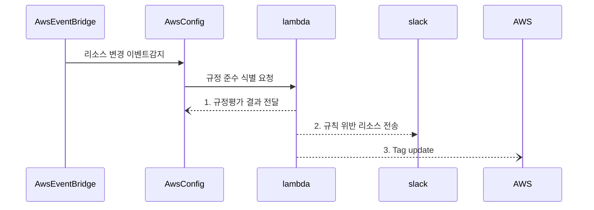
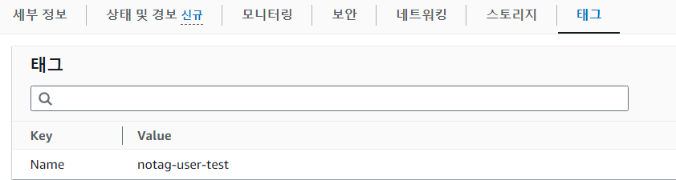

### event-bridge rule 셋팅
```
{
  "detail-type": ["Config Rules Compliance Change"],
  "source": ["aws.config"],
  "detail": {
    "configRuleName": ["Config-no-tag"],
    "messageType": ["ComplianceChangeNotification"],
    "newEvaluationResult": {
      "complianceType": ["NON_COMPLIANT"]
    }
  }
}
```


### lambda 설정
1. requests, json 등의 추가 모듈이 필요함으로 layer 추가

```
import os
import json
import boto3
import requests

def find_violation(current_tags, required_tags):
    violation = ""
    for rtag, rvalues in required_tags.items():
        tag_present = False
        for tag, value in current_tags.items():
            if tag == rtag:
                tag_present = True
                value_match = False
                rvaluesplit = rvalues.split(",")
                for rvalue in rvaluesplit:
                    if value == rvalue:
                        value_match = True
                    if value != "":
                        if rvalue == "*":
                            value_match = True
                if not value_match:
                    violation += "\n" + value + " doesn't match any of " + required_tags[rtag] + "!"
        if not tag_present:
            violation += "\nTag " + str(rtag) + " is not present."
    return violation if violation else None

def evaluate_compliance(configuration_item, rule_parameters):
    if configuration_item["configurationItemStatus"] == "ResourceDeleted":
        return {
            "compliance_type": "NOT_APPLICABLE",
            "annotation": "The configurationItem was deleted and therefore cannot be validated."
        }

    current_tags = configuration_item.get("tags", {})

    violation = find_violation(current_tags, rule_parameters)

    if violation:
        return {
            "compliance_type": "NON_COMPLIANT",
            "annotation": violation
        }

    return {
        "compliance_type": "COMPLIANT",
        "annotation": "This resource is compliant with the rule."
    }

def send_message_to_slack(text):
    webhook_url = os.environ['SLACK_WEBHOOK_URL']
    slack_data = {'text': text}

    response = requests.post(
        webhook_url, data=json.dumps(slack_data),
        headers={'Content-Type': 'application/json'}
    )

    if response.status_code != 200:
        raise ValueError(
            'Request to slack returned an error %s, the response is:\n%s'
            % (response.status_code, response.text)
        )

def update_tags_for_resources(resource_arns, tags, aws_region):
    # boto3 클라이언트 생성
    client = boto3.client('resourcegroupstaggingapi', region_name=aws_region)
    
    # 리소스에 태그 업데이트
    response = client.tag_resources(
        ResourceARNList=resource_arns,
        Tags=tags
    )
    return response


def lambda_handler(event, context):
    # invokingEvent 키의 유무를 사전에 확인
    if 'invokingEvent' not in event:
        send_message_to_slack("Error: 'invokingEvent' key not found in the event object.")
        print("Event object:", json.dumps(event, indent=4))
        return
    else:
        # Lambda 함수의 이벤트 파라미터에서 invokingEvent를 추출하고, 바로 파싱 및 포맷팅하여 출력합니다.
        print(json.dumps(json.loads(event['invokingEvent']), indent=4))
        invoking_event = json.loads(event["invokingEvent"])
        configuration_item = invoking_event["configurationItem"]

        # 여기서부터는 invokingEvent가 존재한다고 가정하고 나머지 로직을 진행합니다.
        try:
            rule_parameters = json.loads(event.get("ruleParameters", "{}"))
            result_token = event.get("resultToken", "No token found.")

            evaluation = evaluate_compliance(configuration_item, rule_parameters)

            # 규정 준수 여부에 따른 메시지 설정
            if evaluation["compliance_type"] == "NON_COMPLIANT":
                resource_id = configuration_item["ARN"].split(":")[-1]
                aws_region = configuration_item["awsRegion"]
                compliance_message = f"NON_COMPLIANT: Resource {resource_id} does not comply with the rule. {evaluation['annotation']}"

                # 슬랙 메시지 구성 및 전송
                slack_message = f"""
                *Compliance Evaluation*
                - Compliance Status: {evaluation["compliance_type"]}
                - Resource Type: {configuration_item["resourceType"]}
                - ARN: {configuration_item["ARN"]}
                - AWS Region: {configuration_item["awsRegion"]}
                - AWS Account ID: {configuration_item["awsAccountId"]}
                - Message: {compliance_message}
                """
                send_message_to_slack(slack_message)

            # AWS Config에 평가 결과 전송
            config = boto3.client("config", region_name=configuration_item["awsRegion"])
            config.put_evaluations(
                Evaluations=[
                    {
                        "ComplianceResourceType": configuration_item["resourceType"],
                        "ComplianceResourceId": configuration_item["resourceId"],
                        "ComplianceType": evaluation["compliance_type"],
                        "Annotation": evaluation["annotation"],
                        "OrderingTimestamp": configuration_item["configurationItemCaptureTime"]
                    },
                ],
                ResultToken=result_token
            )
        except Exception as e:
            send_message_to_slack(f"Error processing event: {str(e)}")
            return
```
