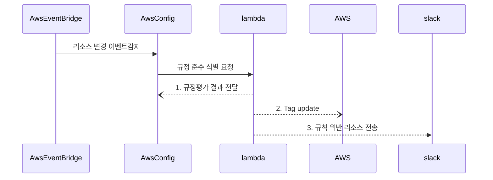
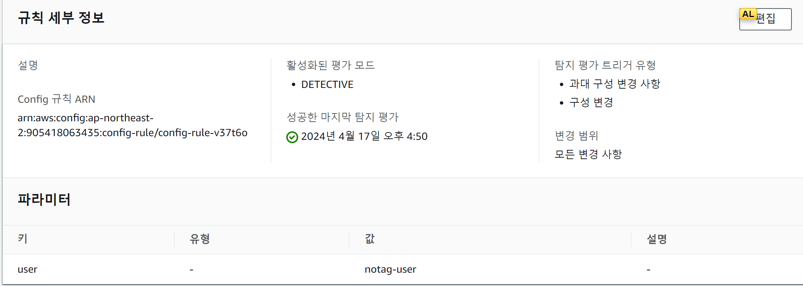
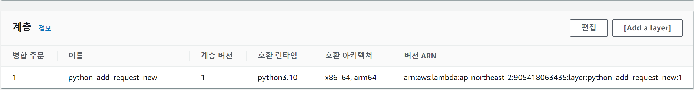
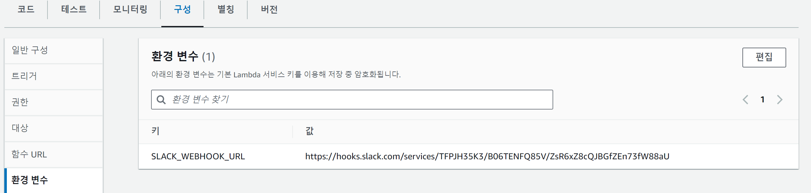

### tag 없는 리소스 생성 시 감지  및 자동업데이트 
---
 - 상황 및 요구사항
     - 개발자분들이 특정 리소스를 자유롭게 생성할 수 있는 환경입니다.
     - AWS에선 비용 추적 및 관리를 위해 태그를 활용할 수 있습니다.
     - 태그가 없이 생성된 리소스에 대해 slack으로 인지하고 \
       또한 자동으로 태깅을 적용하고자 합니다.
     - 해당 코드를 실행하기 위해 slack_url은 외부에서 주입할 수 있어야 합니다.
     - 명시한 상황 이외에는 자유롭게 가정하여 진행하시면 됩니다.

## Architecture
```
구성요소
 - AWS Config 
 - AWS Lambda
 - AWS EventBridge
 - Slack
```




### event-bridge rule 
* 리소스 변경이 감지 될 때 aws config의 설정 된 규칙에 따라 규정 준수 여부를 판단 한다.
```
{
  "detail-type": ["Config Rules Compliance Change"],
  "source": ["aws.config"],
  "detail": {
    "configRuleName": ["Config-no-tag"],
    "messageType": ["ComplianceChangeNotification"],
    "newEvaluationResult": {
      "complianceType": ["NON_COMPLIANT"]
    }
  }
}
```

---

### AWS Config 설정

1. 파라미터 항목에 원하는 tag를 넣어야 조건이 성립 합니다. 
---

### lambda 설정
1. requests, json 등의 추가 모듈이 필요함으로 layer 추가합니다.

2. 환경 변수에 slack_url을 등록합니다



```
import os

import json
import boto3
import requests

def find_violation(current_tags, required_tags):
    violation = ""
    for rtag, rvalues in required_tags.items():
        tag_present = False
        for tag, value in current_tags.items():
            if tag == rtag:
                tag_present = True
                value_match = False
                rvaluesplit = rvalues.split(",")
                for rvalue in rvaluesplit:
                    if value == rvalue:
                        value_match = True
                    if value != "":
                        if rvalue == "*":
                            value_match = True
                if not value_match:
                    violation += "\n" + value + " doesn't match any of " + required_tags[rtag] + "!"
        if not tag_present:
            violation += "\nTag " + str(rtag) + " is not present."
    return violation if violation else None

def evaluate_compliance(configuration_item, rule_parameters):
    if configuration_item["configurationItemStatus"] == "ResourceDeleted":
        return {
            "compliance_type": "NOT_APPLICABLE",
            "annotation": "The configurationItem was deleted and therefore cannot be validated."
        }

    current_tags = configuration_item.get("tags", {})

    violation = find_violation(current_tags, rule_parameters)

    if violation:
        return {
            "compliance_type": "NON_COMPLIANT",
            "annotation": violation
        }

    return {
        "compliance_type": "COMPLIANT",
        "annotation": "This resource is compliant with the rule."
    }

def send_message_to_slack(text):
    webhook_url = os.environ['SLACK_WEBHOOK_URL']
    slack_data = {'text': text}

    response = requests.post(
        webhook_url, data=json.dumps(slack_data),
        headers={'Content-Type': 'application/json'}
    )

    if response.status_code != 200:
        raise ValueError(
            'Request to slack returned an error %s, the response is:\n%s'
            % (response.status_code, response.text)
        )

def update_tags_for_resources(resource_arns, tags, aws_region):
    # boto3 클라이언트 생성
    client = boto3.client('resourcegroupstaggingapi', region_name=aws_region)
    
    # 리소스에 태그 업데이트
    response = client.tag_resources(
        ResourceARNList=resource_arns,
        Tags=tags
    )
    return response

def lambda_handler(event, context):
    event_all = json.dumps(event)
    print(event_all)
    if 'invokingEvent' not in event:
        #send_message_to_slack("Error: 'invokingEvent' key not found in the event object.")
        return

    invoking_event = json.loads(event['invokingEvent'])
    configuration_item = invoking_event.get("configurationItem")
    if not configuration_item:
        #send_message_to_slack("Error: 'configurationItem' key not found in the invokingEvent.")
        return

    rule_parameters = json.loads(event.get("ruleParameters", "{}"))
    result_token = event.get("resultToken", "No token found.")

    evaluation = evaluate_compliance(configuration_item, rule_parameters)

    if evaluation["compliance_type"] == "NON_COMPLIANT":
        resource_id = configuration_item["ARN"].split(":")[-1]
        aws_region = configuration_item["awsRegion"]
        compliance_message = f"NON_COMPLIANT: Resource {resource_id} does not comply with the rule. {evaluation['annotation']}"
        print("tag update 진행")
        update_response = update_tags_for_resources([configuration_item["ARN"]], rule_parameters, aws_region)
        compliance_message += f"\nTags updated for resource {resource_id}. Response: {update_response}"

        # 이벤트 로깅을 Slack 메시지로 전송
    event_text = json.dumps(event)  # JSON 문자열로 변환
    slack_message = f"""
    *Compliance Evaluation*
    - Compliance Status: {evaluation["compliance_type"]}
    - Resource Type: {configuration_item["resourceType"]}
    - ARN: {configuration_item["ARN"]}
    - AWS Region: {configuration_item["awsRegion"]}
    - AWS Account ID: {configuration_item["awsAccountId"]}
    - Message: {compliance_message}
    - 위 리소스는 tag가 update 될 예정입니다.
    """
    send_message_to_slack(slack_message)
```
---
### slack 설정
1. 가장 간단한 incomming webhook으로 구성 합니다.
2. slack url이 나오면 람다 코드의 환경 변수에 주입 합니다.