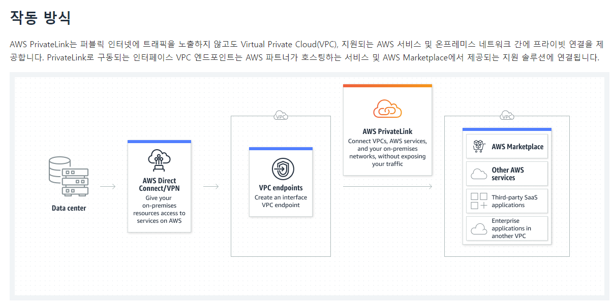
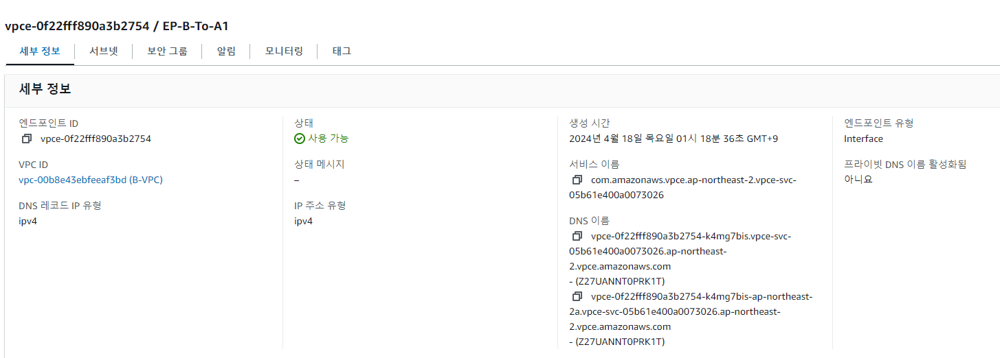

# VPC간 네트워크 연동 문제 
```
아래 제시된 상황에 맞는 답변을 부탁드립니다.
    - 상황
        - 서로 다른 VPC로 운영되는 서비스를 연동하고자 합니다.
        - 동일한 AWS Account 중 VPC_A 에는 EKS 기반으로, VPC_B에는 ECS 기반으로 운영중입니다.
    - 문제
        - VPC_A EKS 서비스와 VPC_B ECS 서비스가 통신하기 위한 방법에 대해 아는 바 자유롭게 설명부탁드립니다.
         (단, 해당 기능을 선택한 이유를 명시바랍니다)
        - 만일, *서로 다른 계정*에서 운영되는 각 VPC CIDR가 동일한 경우 통신을 위해 어떻게 설계할 수 있는지 설명 부탁드립니다.
```


vpc 간 통신을 위해서는 크게 2가지 방법이 있습니다.
* VPC Peering 
* Transit Gateway

- 요약해서 간단하게 정리하자면 VPC간 연동해야 할 가짓수가 적으며 앞으로도 늘어날 일이 거의 없다면 VPC Peering을 선택
- 반대로 vpc나 온프레미스 연결이 지속적으로 늘어날 것 같으면 중앙 집중식 네트워크 관리 hub인 TGW를 선택 하면 됩니다.


## VPC Peering 란?
---
VPC 피어링 연결은 프라이빗 IPv4 주소 또는 IPv6 주소를 사용하여 두 VPC 간에 트래픽을 라우팅할 수 있도록 하기 위한 두 VPC 사이의 네트워킹 연결입니다.
동일한 네트워크에 속하는 경우와 같이 VPC의 인스턴스가 서로 통신할 수 있습니다.
사용자의 자체 VPC 또는 다른 AWS 계정의 VPC와 VPC 피어링 연결을 만들 수 있습니다. VPC는 다른 리전에 있을 수 있습니다(리전간 VPC 피어링 연결이라고도 함).


## Transit Gateway 란?
---
AWS Transit Gateway는 고객이 자신의 Amazon Virtual Private Cloud(VPC)와 온프레미스 네트워크를 단일 게이트웨이에 연결할 수 있도록 지원해 주는 서비스입니다.
 AWS에서 실행하는 워크로드가 점차 늘어나고 있으므로 이러한 증가에 발맞추기 위해 여러 계정과 Amazon VPC 전반에서 네트워크를 확장할 수 있어야 합니다.
현재는 피어링을 사용하여 Amazon VPC의 페어를 연결할 수 있습니다.
그러나, 지점 간 연결 정책을 중앙에서 관리하는 기능 없이 여러 Amazon VPC 전반의 지점 간 연결을 관리하면 운영 비용이 많이 들고 번거로울 수 있습니다.
온프레미스 연결의 경우 AWS VPN을 각 Amazon VPC에 따로 연결해야 합니다. 
이 솔루션은 구축하는 데 시간이 오래 걸리며 여러 VPC가 수백 개로 늘어나면 관리하기가 힘들어질 수 있습니다.


## but 한계점
---
그러나 TGW / Peering도 한계점은 있습니다.
두 가지 모두 CIDR 대역폭을 라우팅 하기 때문에 마치 다른 네트워크 이지만 하나의 네트워크 인것 마냥 라우팅 설정을 해주면 하나의
온프레미스나 VPC처럼 원하는 IP 대역으로 접근이 가능 하나 CIDR이 겹친다면 다른 VPC내의 IP를 찾지 못 할 것입니다.

## 해결책
---
* 해결책은 AWS 서비스 중 Private Link를 이용 하는 것입니다.



AWS 콘솔에서 찾아보면 private link라는 솔루션은 없습니다.


그 이유는 실제 private link를 구성 하기 위한 구성 요소는 아래와 같기 때문입니다.

* 구성요소
    * VPC Endpoint
    * VPC Endpoint Service

테스트를 위해 동일한 CIDR의 VPC를  구성하겠습니다.


B Accouunt VPC -> A Account VPC를 호출 하는 구성입니다. 
아키텍처는 아래와 같습니다.


구성은 작업은 역순으로 해주는게 좋습니다.

## Endpoint Service 구성 (A VPC)


## Endpoint 구성 (B VPC)


A B 둘다 Ec2를 생성 하고 호출 테스트를 진행 한 결과 입니다.
호출은 B의 endpoint에 있는 DNS이름으로 호출 하면 됩니다.

