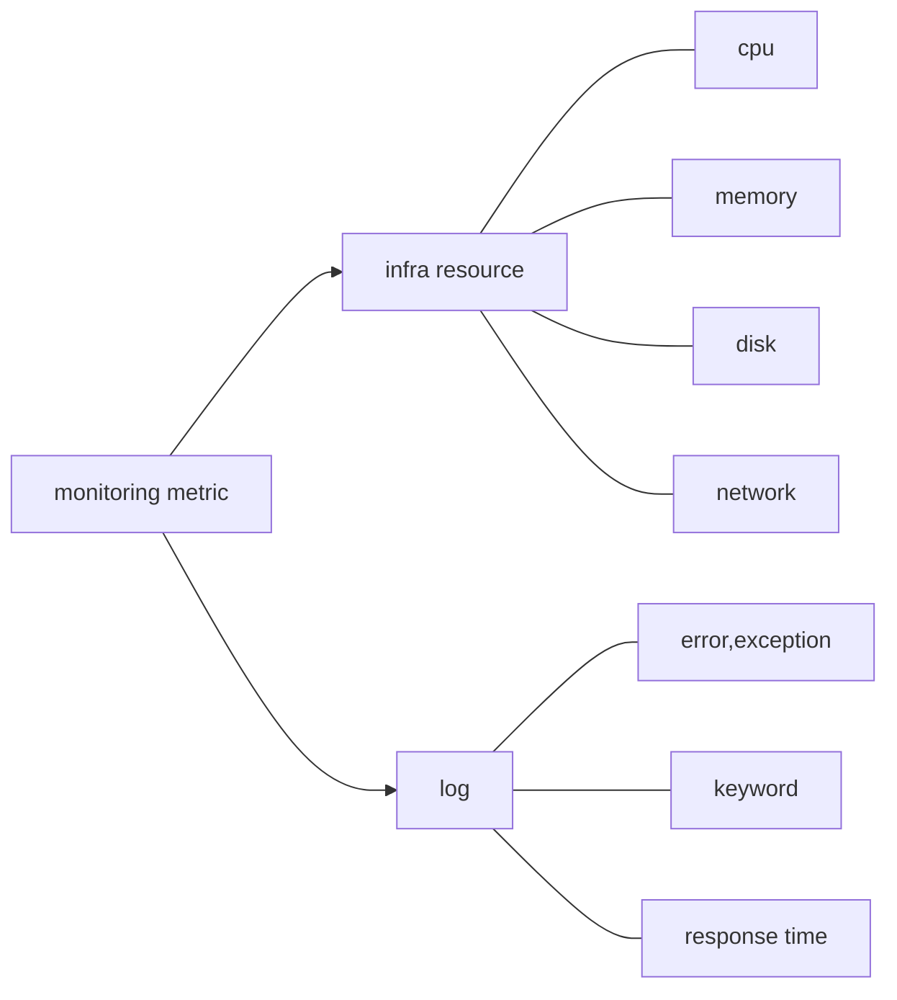

# [페이히어] 데브옵스 엔지니어 (DevOps Engineer) 과제 전형 안내


## 과제 
```
 페이히어는 EKS를 기반으로 서비스를 하고 있습니다. 서비스 연속성을 위해 무중단은 필수 요건입니다. 무중단을 위해 해야할것을 아는바 상세히 설명부탁드립니다. \
  * 필수 키워드
     * 이미 서버에 들어온 트래픽
     *  main process 
```

## **과제 설명**
```
안녕하세요 먼저 면접 기회를 주셔서 감사 드립니다.
포스 , 키오스크 전문 기업이며 주로 돈이 오고 가는 결제 서비스를 운영 하시다 보니 
서비스 안정성이 제일 중요 하다고 판단 되며 그에 걸 맞도록 과제를 진행 하여 보겠습니다.
```


## 무중단 서비스
서비스 연속성을 위한 무중단, 즉 고가용성을 달성 하기 위해서는 여러가지 항목을 고려 해야 합니다. 
eks 기반이라는 가정 하에 큰 단위의 resource 부터 나열 하자면


## resource
 - provider(AWS) 
    - CSP도 서비스 가용성이 100%는 아닙니다. 
    - 자체 IDC를 구축하여 하이브리드 클라우드를 구축 하거나 멀티 클라우드를 구축 하는 방법도 있습니다.
    - 멀티 or 하이브리드 클라우드를 구축 하였다면 dns 서버에서 가중치를 조절 하여 트래픽을 분산 할 수 있습니다. 
 - nework(vpc-elb)
    - ELB는 상당히 많은 양의 트래픽도 감당 할 수 있는 AWS의 Proxy 서비스입니다.
    - 서비스 가용성, 무중단 배포를 위해서는 ecs, eks위에 elb를 연결 해야 합니다.
    - EKS와 ELB는 서로 긴밀한 관계를 맺고 있습니다. 
    - EKS에서 생성 된 POD는(service : LoadBalnace) ELB(type : ip)의 VPC  subnet과 같은 대역의  IP를 가지고 있습니다.

 - node(ec2)
   - node란 실제 물리 서버를 의미 합니다. kubernetes용어로는 worker-node라 합니다.
   - node의 사양에 따라 eni의 갯수가 정해지기 때문에 부족하지 않게 node의 사양과 pod , sidecar , daemonset의 갯수를 고려 하여 설계해야 합니다.
   - eks에서는 node의 갯수를 사전정의 할 수 있습니다. 기본적으로 쓰이는 것은 autoscale group입니다.
   - 조금 더 빠르고 효율적으로 노드 갯수를 변경 하고 싶다면 Karpenter도 좋은 선택이 될 것입니다.
- pod
  - eks에서 서비스(main process)를 제공 하기 위해서는 pod에 서비스를 올려야 합니다.
    - pod를 구동하는 방법은 크게 3가지가 있습니다. [ pod / static pod / deployments ] 
    - [ deployments ] : pod에 대한 설정과 더불어 각종 서비스/lable/volume 설정  및  replica 갯수등의 설정이 포함 되어 있어 상시 원하는 replica 숫자 만큼 pod의 갯수를 유지 하려고 합니다 \
                 따라서 무중단 서비스를 위해서라면 일반적으로 POD를 구동 시 deployments를 이용해서 구성 해야 합니다.
    - 이미 들어온 트래픽 관리 : 이미 트래픽이 들어온 상태에서 db에 데이터를 쓰거나 어플리케이션이 한창 구동 중일 때 배포나 scaleout 등의 이유로 노드에 변경 사항이 생기면 \
                            쿠버네티스는 pod의 위치를 재조정 하려 하고 현재 파드에서 실행 중인 세션은 없어지게 될 것입니다.  이 경우 해결책은 아래와 같습니다. 
      - pod 종료 이전에 해당 pod 내 서비스가 남아 있는지 확인
      - Prestop hook 을 이용 하여 pod 내 서비스가 남아 있는지 여부를 확인 하는 스크립트를 작성 후 적용
```
apiVersion: v1
kind: Pod
metadata:
  name: lifecycle-demo
spec:
  containers:
  - name: lifecycle-demo-container
    image: nginx
    lifecycle:
      preStop:
        exec:
          command: ["/bin/sh","-c","status.sh"]
  terminationGracePeriodSeconds: 600
```
  
 - database
   - DB 또한 위와 같은 맥락으로 auto scale이 된다면 비용 / 무중단 서비스에 크게 기여를 하게 됩니다.
   - 가능하다면 aurora RDS 사용을 추천하며 당장 전환이 어렵다면 read - replica db를 구성 하여 안정성을 도모 할 수 있습니다.
 - 기타 서비스 component (redis, kafaka 등) 
   - redis , kafaka , mongoDB 등을 활용 하면 DB와 어플리케이션의 부하를 감소시켜주고 빠른 응답속도를 사용자에게 제공 해줄 수 있습니다.
     해당 서비스는 대부분 key-value기반의 nosql의 원리를 갖음으로 기본적으로 autoscale 가능한 구조로 설계되어 있습니다.

## CICD
- 과거에는 배포를 하고 나면 소스 적용을 하기 위해 WAS를 재구동 하여 프로세스가 up/down이 되었고 일일이 사람의 손으로 수작업을 하는 경우가 많았습니다. 
- 현재 devops의  배포 방식은 기본적으로 rolling , blue/green, Canary를 택하여 구현을 합니다.
    - 구현 난이도는 rolling > blue/green >  Canary 순이며 난이도가 높을 수록 검증 하기에 유리합니다.
- 무중단 서비스를 위해서라면 개발 / 스테이징 단계의 검증도 매우 중요합니다. Devops조직은 CICD내에 검증도 자동으로 구현 할 수 있도록 지원하는 프로세스가 마련 되어야 합니다.
  보통 아래 솔루션들을  CICD Pipe line에 많이 포함 하고 있습니다.
   - SonarQube
   - Junit
   - Selenium 


## Monitoring / Alret / Log
 - 무중단 서비스를 위해서는 장애 감지 및 사전 예방 등도 매우 중요합니다.
 - 그러기 위해서는 인프라 가시성 확보도 매우 중요한 과제 중 하나 일 겁니다.
 - 인프라 모니터링은 크게 두가지가 있습니다.



## Maintenance
 - cluster upgrade
 - DB 작업
 - 

